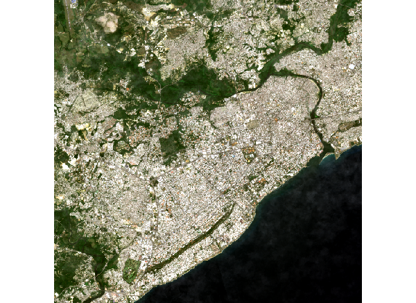
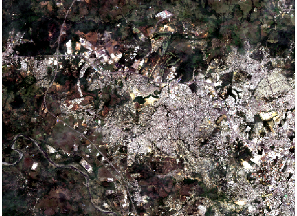
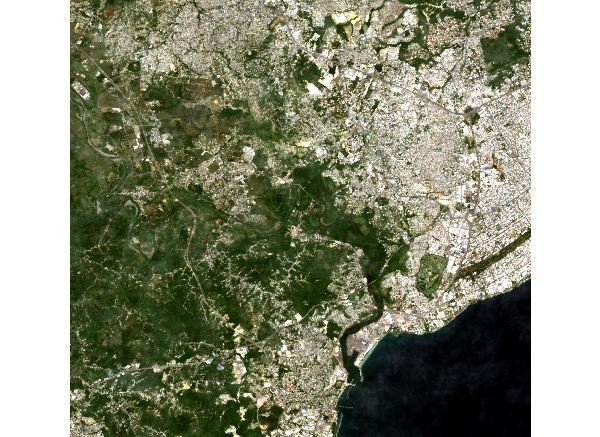
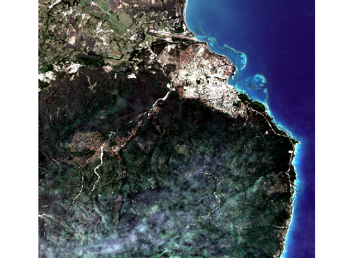

# Imágenes satelitales de República Dominicana

El proyecto contiene recursos para reproducir la descarga y análisis de imágenes satelitales de alta resolución de República Dominicana, a distintos niveles de la desagregación político-administrativa.

## Estructura del proyecto

**Data:** aquí se almacena la data input/output en los potenciales formatos (`.xlsx`, `.rds`, `.tif`, `.shp`, `.csv`). Por lo pesado que son las imagenes satelitales, lamentablemente los archvios `.tif` no se encuentran directamente en este repositorio, se deben descargar de este [folder de google drive](https://drive.google.com/drive/folders/1DeY5X4ITCouKRRUax6pODYYhhf9zcQ5V?usp=sharing).

En este repositorio solo hay algunas imágenes de prueba. se encuentran en `data/testing/`

**Scripts:** contiene el código para reproducir cada uno de los pasos del análisis

- `scritpts/municipios_metadata.R` usando la distribución geográfica nacional prepara la metadada de todos los municipios del país. Estos sirve para preparar los códigos en Java Script que se usan en la plataforma de google para descargar las imágenes, y para explorar los resultados.

- `scritpts/genera_codigo_para_gee.R` En este script se genera el código que se puede usar en Google Search Engine para descargar las imágenes satelitales

- `scritpts/google_earth_engine/export_sentinel_images.js` un js file que se puede pegar íntegramente en la consola de Google Earth Engine y descargar las imagnes de todos los municipios de república dominicana. Si se cambia el parámetro fecha se puede seleccionar la fecha de las imágenes

- `scritpts/read_and_plot_tif.R` Muestra como importar y graficar las imágenes tiff una vez se tienen.

### Arbol del repositorio

> excluye archvios secundario como el `lock.file` con las dependencias y el archivo de proyecto de Rstudio

```
├── data
│   ├── excel
│   │   └── municipios_metadata.xlsx
│   ├── images
│   │   └── sattelite
│   ├── rds
│   │   ├── municipios_medatada.rds
│   │   └── municipios_sf.rds
│   ├── shapefiles
│   │   ├── barrios
│   │   ├── distritos_municipales
│   │   ├── municipio
│   │   ├── provincia
│   │   ├── region
│   │   └── seccion
│   └── testing
│       ├── reg_06-prov_04-mun_01-name__barahona.tif
│       ├── reg_10-prov_01-mun_01-name__santo_domingo_de_guzman.tif
│       ├── reg_10-prov_32-mun_02-name__santo_domingo_oeste.tif
│       └── reg_10-prov_32-mun_06-name__los_alcarrizos.tif
├── dependencies.R
└── scripts
    ├── municipios_metadata.R
    ├── genera_codigo_para_gee.R
    ├── google_earth_engine
    │   └── export_sentinel_images.js
    └── read_and_plot_tif.R
```

## Cómo reproducir

Este es un repositorio con control de dependencias con el paquete `{renv}`, a continuación los pasos para obtener todo.

1. Descargar manualmente el repositorio o clonarlo con la terminal `git clone https://github.com/Johan-rosa/satellite_and_poverty.git`

2. Instalar el paquete `{renv}`, en R correr `install.packages("renv")`

3. Restaurar las dependencias: `renv::restore()`

Una vez de restauren las dependencias se puede correr cualquiera de los scripts

## Fuente de las imágenes

### Plataforma de procesamiento de descargas

Para la descarga de las imágenes se utilizó el servicio [Google Search Engine](https://earthengine.google.com/) de Google, un servicio con un amplio catálogo de imágenes y datos geoespaciales a nivel planetario. Está diseñado para que investigadores y desarrolladores puedan detectar cambios y tendencias en la superficie terrestre.

### Fuente de las imágenes satelitales

La imágenes provienen del *Copernicus Program*, una iniciativa de la Comisión Europea y la Agencia Espacial Europea. Específicamente de los satelites Sentinel, una constelación de satelites desarrollados en el marco del programa copernicus que generan imágenes planetarias de alta resolución con propósitos múltiples.

El data set utilizado es el del [Sentinel-2 MSI: Multispectral Instrument](https://developers.google.com/earth-engine/datasets/catalog/sentinel-2), un set de imagenes multiespectrales de alta resolución, con una frecuencia de circulación planetaria de 5 días que permite monitorear la evolución de áreas terrestres y marinas, fenómenos naturales y sus consecuencias.

> [Enlace hacia los detalles técnicos del dataset](https://developers.google.com/earth-engine/datasets/catalog/COPERNICUS_S2_SR_HARMONIZED)

## Muestra de algunas imagenes

> Esta es una versión de baja resolución de las imagenes en formato PNG, las originas están en formato tiff en la carpeta `data/testing/`

#### Distrito Nacional


#### Los Alcarrizos


#### Santo Domingo Oeste


#### Barahona
